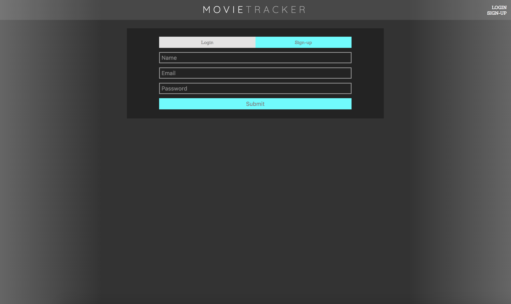

## Movie Tracker

Movie Tracker is a 3-person project for Turing School of Software & Design that was built in one week by students Rob Morgan, Maria St. Louis, and Hugh Hartigan.  It is built in React/Redux, uses Router and Thunk middleware, and is thoroughly tested in Jest/Enzyme.  

Movie information and pictures are pulled from themoviedb API and user information is saved on our own backend.

Users have the ability to create accounts, sign in, browse movies along with movie information, favorite any movies they see, build and edit favorite movie lists, and more.  Styling is our own and created using SCSS.  It looks great on all devices from large screens to mobile devices.

An initial API call is triggered in a componentDidMount function to pull current movie data.  As well, user favorites were saved and edited to user accounts on the backend.

This was our first foray into Redux, although we were already experienced in React.  We received high marks on evaluations.

********

The homepage immediately displays movies that are currently showing, and allows users to favorite them by clicking on the blue stars (which hover to solid) on each movie.  There are also links to login and signup on the nav bar.

********

The signup screen can be switched to signup screen where it will only require email and password.  Once signed in, the user's favorites will display.  As well, a link for viewing only favorited movies will display.

